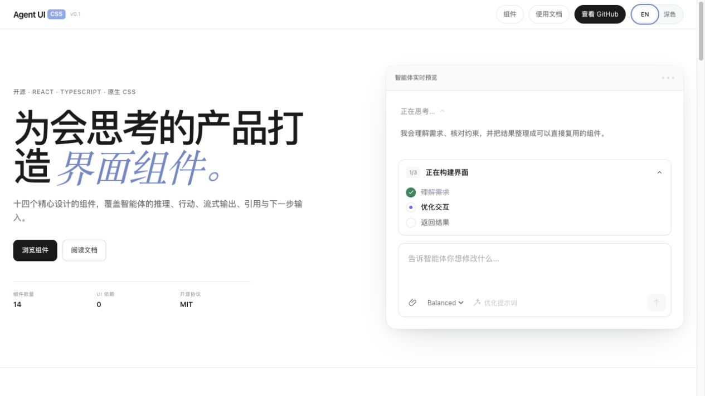

<div align="center">


# Agent UI CSS

Polished React interface building blocks for AI and agent products.

[Live demo](https://au.lansuan.cc/) · [简体中文](./README.md) · [Components](#components) · [Contributing](./CONTRIBUTING.en.md)

[](https://github.com/zhaoxinyi02/agent-ui-css/actions/workflows/ci.yml)
[](./LICENSE)
[](https://react.dev/)
[](https://www.typescriptlang.org/)

</div>



## About

Agent UI CSS is an original, lightweight collection of composable React components for AI products that reason, use tools, stream results, cite sources, and ask users for the next input.

- 14 purpose-built AI and agent interface components
- A complete vendored source collection of 64 Appica UI React components
- 13 original SVG icons
- Complete TypeScript types
- No runtime UI dependency beyond React
- Plain CSS with an `aui-` class prefix for easy composition
- Accessible semantics and reduced-motion support
- Localizable text props and automatic dark theme support

## Quick start

### Install

Until the package is published to npm, install it directly from GitHub:

```bash
npm install github:zhaoxinyi02/agent-ui-css#v0.1.0
```

React 18 or newer is required as a peer dependency.

### Use a component

```tsx
import { AgentInput, ThinkingReasoning } from "agent-ui-css";
import "agent-ui-css/styles.css";

export function AgentPanel() {
  return (
    <div className="aui-auto-theme">
      <ThinkingReasoning seconds={6}>
        <p>Reviewing the request and checking the available context.</p>
      </ThinkingReasoning>

      <AgentInput
        placeholder="Ask the agent…"
        models={["Fast", "Balanced", "Deep"]}
        onSubmit={(value, model) => console.log({ value, model })}
      />
    </div>
  );
}
```

## Components

| Category | Components | Best for |
| --- | --- | --- |
| Thinking and state | `ThinkingState`, `ThinkingReasoning`, `Orbs` | Thinking, expandable reasoning, activity states |
| Tools and actions | `WebSearch`, `FileDiff`, `ImageGeneration` | Search progress, diffs, image generation |
| Text output | `TextResponse`, `StreamingText`, `CitationMark`, `InlineCitations`, `CodeBlock` | Responses, streaming, citations, code |
| Structured output | `TaskList`, `DataTable`, `ComparisonTable` | Progress, data, plan comparison |
| User input | `AgentInput` | Prompts, model selection, submission |
| Primitives | `Icon` | 13 consistent SVG icons |

See every component and state in the [live demo](https://au.lansuan.cc/). Components and related TypeScript types are exported from the package root.

The repository also preserves the full source for 64 Appica UI React components under [`vendor/appica-ui-react`](./vendor/appica-ui-react), with a dedicated [online catalog](https://au.lansuan.cc/appica.html). That collection remains under its upstream MIT License; see [third-party notices](./THIRD_PARTY_NOTICES.md).

## Theming

Override CSS variables near your application root to create your own theme:

```css
.my-agent-app {
  --aui-bg: #ffffff;
  --aui-surface: #f7f7f8;
  --aui-text: #18181b;
  --aui-muted: #71717a;
  --aui-border: #e4e4e7;
  --aui-accent: #6d5efc;
  --aui-accent-soft: #eeecff;
  --aui-success: #16865c;
  --aui-danger: #d24242;
  --aui-radius: 14px;
  --aui-font: Inter, sans-serif;
}
```

Add `.aui-auto-theme` to a container to apply the included dark tokens when the operating system prefers dark mode. The demo also persists language and theme choices: first visits follow system preferences, while manual choices take priority afterward.

Visible component text is supplied through props such as `thinkingLabel`, `copyLabel`, `placeholder`, and `sendLabel`, making the library compatible with any internationalization solution.

## Local development

```bash
git clone https://github.com/zhaoxinyi02/agent-ui-css.git
cd agent-ui-css
npm install
npm run dev
```

| Command | Purpose |
| --- | --- |
| `npm run dev` | Run the local component showcase |
| `npm run check` | Run TypeScript checks |
| `npm run build` | Build the library and declarations |
| `npm run build:site` | Build the deployable demo into `site-dist/` |

## Project structure

```text
src/lib/components.tsx  Components, icons, and public types
src/lib/styles.css      Component styles and theme tokens
src/App.tsx             Bilingual component showcase
src/demo.css            Showcase layout styles
```

## Community and license

- Read the [contribution guide](./CONTRIBUTING.en.md) before submitting code
- Follow the community [Code of Conduct](./CODE_OF_CONDUCT.md)
- Review licenses for vendored code in [third-party notices](./THIRD_PARTY_NOTICES.md)
- See the [security policy](./SECURITY.md) for vulnerability reports
- Follow project changes in the [changelog](./CHANGELOG.md)
- Licensed under the [MIT License](./LICENSE)

Issues, feature requests, and pull requests are welcome. If the project helps you, consider giving it a Star.
